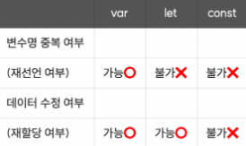

# 자바스크립트

- 웹 페이지를 동적으로 동작할 수 있도록 만들어주는 프로그래밍 언어

### 변수 선언

### 배열 Property, Method

- array.length : 배열의 길이
- array.push(data) : data를 array에 추가
- array.pop() : array의 가장 뒤의 데이터를 추출
- array.includes(data) : array에 data가 포함되어 있는지 boolean으로 반환
- array.indexOf(data) : array에서 data의 인덱스를 반환 없으면 -1 반환

### 객체 Method

- Object.keys() : 객체의 key만을 배열로 반환
- Object.values() : 객체의 value만을 가져와 배열로 반환
